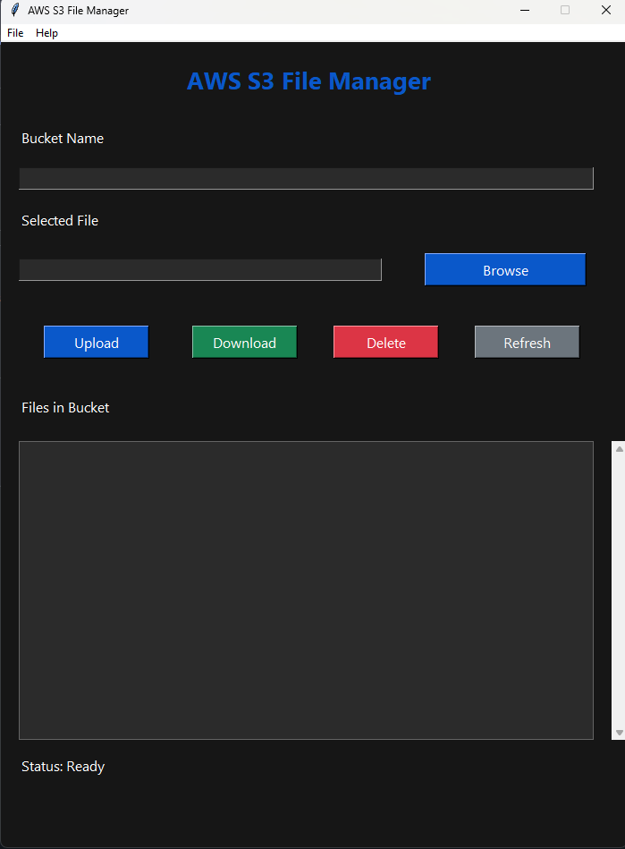
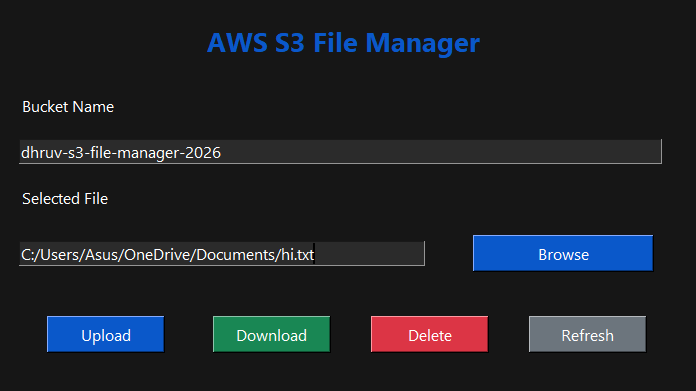
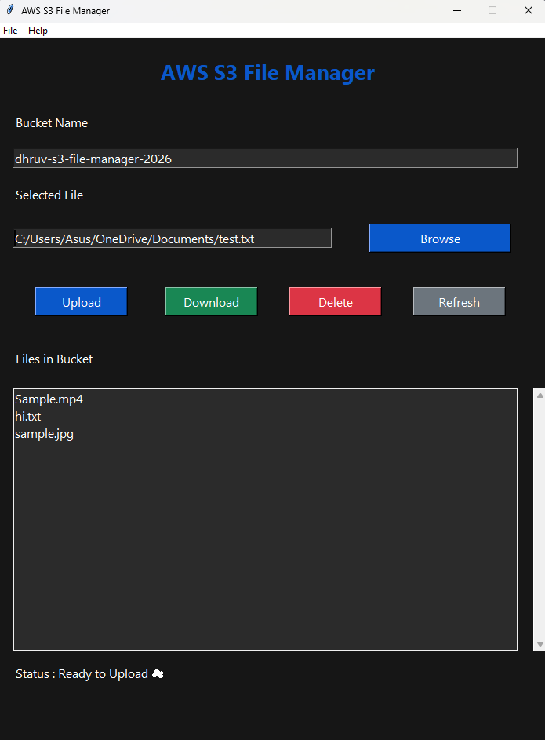
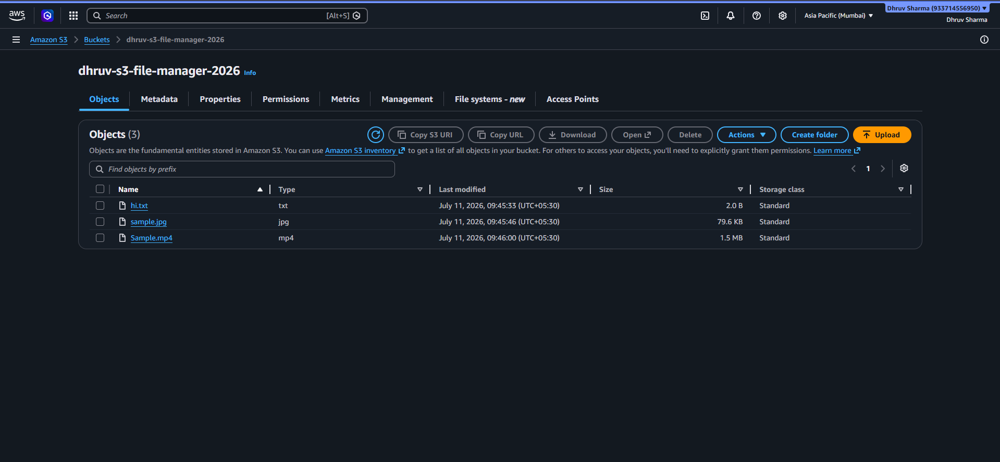

# ☁️ AWS S3 File Manager

A modern desktop application built with **Python**, **Tkinter**, and **Amazon S3** that allows users to securely upload, download, delete, and manage files stored in AWS S3 buckets.

---

## ✨ Features

- 📤 Upload files to Amazon S3
- 📥 Download files from Amazon S3
- 🗑️ Delete files from S3
- 🔄 Refresh bucket contents
- 📂 Browse files using File Explorer
- 📋 Display all files stored in the bucket
- ⚠️ Error handling with dialog boxes
- ✅ Delete confirmation dialog
- 🌙 Modern Dark Theme UI
- 📊 Status bar for operation updates
- 📑 Menu Bar with About section

---

## 🛠️ Technologies Used

- Python
- Tkinter
- AWS S3
- boto3
- AWS CLI
- IAM

---

## 📷 Screenshots

#### Home Screen



---

### File Selected



---

### Bucket Contents



---

### AWS S3 Console



---

## Installation

Clone the repository

```bash
git clone https://github.com/Dhruvkunn/AWS-S3-File-Manager.git
```

Install dependencies

```bash
pip install -r requirements.txt
```

Configure AWS CLI

```bash
aws configure
```

Run the application

```bash
python src/aws_s3_file_manager.py
```

---

## 📁 Project Structure

```text
AWS-S3-File-Manager/
│
├── assets/
├── src/
├── README.md
├── requirements.txt
├── LICENSE
└── .gitignore
```

---

## 🔮 Future Improvements

- Multi-file upload
- Drag & Drop support
- Progress bar
- Bucket selection dropdown
- Search functionality
- Rename files

---

## 👨‍💻 Developer

**Dhruv Sharma**

GitHub:
https://github.com/Dhruvkunn

LinkedIn:
https://www.linkedin.com/in/dhruv-sharma-319370413/

---

## ⭐ If you found this project helpful, consider giving it a star!